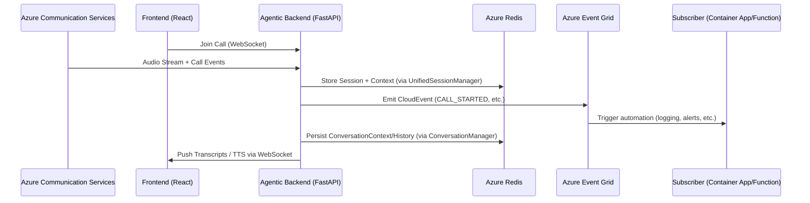
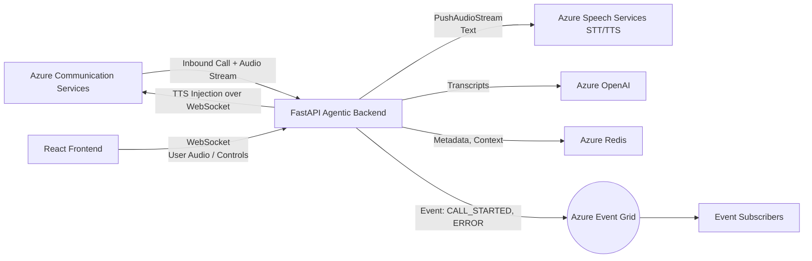
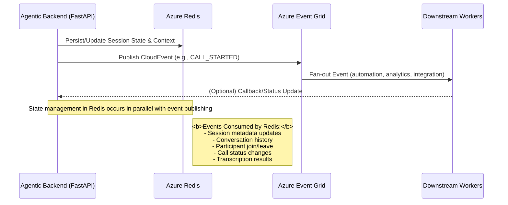

# 🎧 Real-Time Agentic Voice System — State & Event Flow (Azure-Aligned)

## 🧭 Overview

This document details the architecture for a real-time, voice-driven agent system. It highlights the flow of events and modular responsibilities, leveraging key Azure services:

- **Azure Communication Services (ACS):** For VoIP/PSTN calling.
- **Azure Redis:** For managing hybrid runtime and persisted session state.
- **Azure Event Grid:** For triggering automation and enabling observability.
- **Azure Speech Services & Azure OpenAI:** For speech-to-text (STT), text-to-speech (TTS), and agent intelligence.

---

## 🧠 Core Components

| Component             | Role                                                                 |
|----------------------|----------------------------------------------------------------------|
| Agentic Backend (FastAPI) | Hosts real-time voice logic, WebSocket/STT integration, and session manager |
| Azure Redis           | Persists session metadata and conversation context with TTL          |
| Azure Event Grid      | Triggers external automation workflows based on session events       |
| Azure OpenAI          | Generates natural language agent responses                           |
| Azure Speech Services | Handles STT (push stream) and TTS for dynamic agent replies          |
| Frontend (React + ACS JS SDK) | Visual UI for call control, live transcripts, and state feedback |

---

## 🧩 Integration Responsibilities

| Flow Step | Owner         | Mechanism |
|-----------|---------------|-----------|
| Call state updated (`CALL_STARTED`, `PARTICIPANT_JOINED`, etc.) | `UnifiedSessionManager` | `emit_event()` triggers internal callbacks + publishes CloudEvent to Event Grid |
| Session context/history updated | `ConversationManager` | `persist_to_redis()` serializes session state |
| Event Grid subscription triggers logic | Event Grid + Subscribers | Azure Function, Logic App, or Webhook endpoint receives CloudEvents |

---

## 🔄 State & Event Flow (Mermaid Diagram)
The diagrams below illustrate the system's real-time state and event flow, detailing interactions between Azure services and application components during a call session.

### Sequence Diagram: End-to-End Session Flow

This sequence diagram details the chronological flow of events and data between the core components:

- **Frontend (React)** initiates a call session by connecting to the backend via WebSocket.
- **Azure Communication Services (ACS)** streams audio and call events to the backend.
- **Agentic Backend (FastAPI)** manages session state, persists context to **Azure Redis**, and emits CloudEvents (such as `CALL_STARTED`) to **Azure Event Grid**.
- **Azure Event Grid** fans out events to downstream subscribers, such as **Azure Functions** for automation or logging.
- The backend continues to persist conversation history and pushes live transcripts or TTS responses back to the frontend.



### Component Interaction Diagram: System Architecture

This graph diagram provides a high-level overview of the system architecture and data flow:

- **ACS** and the **React Frontend** both send audio streams and control signals to the backend.
- The **backend** orchestrates voice processing, state management, and event emission:
    - Sends audio/text to **Azure Speech Services** for STT/TTS.
    - Interacts with **Azure OpenAI** for agent intelligence and response generation.
    - Persists session metadata and conversation context in **Azure Redis**.
    - Publishes key events (e.g., `CALL_STARTED`, `ERROR`) to **Azure Event Grid**.
- **Azure Event Grid** distributes events to downstream consumers (e.g., Azure Functions, Logic Apps) for further automation, monitoring, or integration.

These diagrams collectively clarify the separation of concerns, real-time data flow, and event-driven automation patterns that underpin the agentic voice system on Azure.



### 🔔 Event Grid Subscriber Invocation: Real-Time Automation Flow

The following diagram illustrates how Azure Event Grid fans out call lifecycle events to various subscribers—such as Azure Functions, Container Apps, or Logic Apps—for automation, enrichment, or integration tasks in the context of the real-time agent backend.

**Key Call Events Handled:**
- `CALL_STARTED`: Initialize downstream workflows, allocate resources, or log session start.
- `PARTICIPANT_JOINED`: Trigger participant-specific logic (e.g., authentication, notifications).
- `RECORDING_STARTED`: Start compliance or storage workflows.
- `ERROR_OCCURRED`: Alerting, diagnostics, or escalation routines.

**Typical Subscriber Logic:**
- Receives a CloudEvent payload via an HTTP POST request from Azure Event Grid.
- Validates the event type and extracts session or call metadata from the request body.
- Processes the event according to business logic (e.g., automation, logging, integration).
- Optionally, responds with a 200 OK to acknowledge successful handling.
- Executes domain-specific automation (e.g., persisting transcripts, updating dashboards, invoking external APIs).
- Optionally, posts results or status updates back to the agent backend or other services.


**Example: Azure Function Event Handler Pseudocode**
```python
import azure.functions as func

def main(event: func.EventGridEvent):
    event_type = event.event_type
    data = event.get_json()
    if event_type == "CALL_STARTED":
        # Initialize resources, log, or notify
        pass
    elif event_type == "PARTICIPANT_JOINED":
        # Handle participant logic
        pass
    elif event_type == "ERROR_OCCURRED":
        # Trigger alerting
        pass
```

This pattern enables scalable, loosely-coupled automation and observability for each significant event in the agentic voice system.

---

## ⚖️ Parallel Redis Runtime Persistence Split
This section explains how runtime objects are managed across multiple workers, particularly concerning shared state in Redis versus in-memory objects that are isolated to a specific worker process.

```
[ Worker A ]                         [ Worker B ]
  ┌────────────┐                    ┌────────────┐
  │ Redis read │  <---shared--->    │ Redis read │
  │ WebSocket  │  <- isolated ->    │ X (not accessible)
  │ STT stream │  <- isolated ->    │ X (not accessible)
  └────────────┘                    └────────────┘
```
> ⚠️ A worker that didn’t initiate the session can’t emit TTS back to ACS or write to that WebSocket unless routing logic pins that call to a specific worker.

### Redis vs. In-Memory Runtime Objects

| Type                   | Stored in Redis | Shared Across Workers | Notes                                 |
|------------------------|:--------------:|:--------------------:|---------------------------------------|
| SessionDocument (state)|      ✅ Yes     |        ✅ Yes         | Must serialize/deserialize            |
| WebSocket connection   |      ❌ No      |        ❌ No          | Lives only in memory of one worker    |
| PushAudioInputStream   |      ❌ No      |        ❌ No          | One per STT stream, per worker process|
| Transcription          |      ✅ Yes     |        ✅ Yes         | After decoding from STT               |
| Conversation context   |      ✅ Yes     |        ✅ Yes         | Used to ground OpenAI input           |
| Active asyncio.Task    |      ❌ No      |        ❌ No          | Can’t resume from another worker      |

---

## 🧱 Separation of Concerns

### Call Session State

| Concern                        | Owner              | Persisted | Notes                                         |
|---------------------------------|--------------------|-----------|-----------------------------------------------|
| Call metadata                   | CallMetadata       | ✅ Redis  | `call_id`, timestamps, participants             |
| Conversation history + context  | ConversationManager| ✅ Redis  | For LLM prompting and state tracking          |
| Runtime objects (WebSocket, STT)| CallSession        | ❌ Memory | Includes `tts_queue`, `acs_ws`, etc.          |

### Voice Streaming Events
| Event Type         | Direction            | Notes                                         |
|--------------------|----------------------|-----------------------------------------------|
| `AUDIO_RECEIVED`     | ACS/FE → Backend     | Audio push via ACS or frontend WebSocket      |
| `STT_COMPLETE`       | Backend → OpenAI     | Transcript completed, LLM invoked             |
| `TTS_RESPONSE`       | OpenAI → ACS         | Synthesized voice returned via ACS TTS        |
| `TRANSCRIPT_PUSHED`  | Backend → FE         | Live transcript updates                       |

### Lifecycle + Automation Events

| Event Type             | Emitted By                        | Fan-out Purpose                          |
|------------------------|-----------------------------------|------------------------------------------|
| `CALL_STARTED`           | UnifiedSessionManager             | Kick off session-specific workflows      |
| `PARTICIPANT_JOINED`     | ACS callback / Backend            | Enforce quorum, signal start conditions  |
| `RECORDING_STARTED`      | Backend                           | Recording lifecycle observability        |
| `TRANSCRIPTION_RECEIVED` | STT handler (internal)            | Not emitted to Event Grid                |
| `ERROR_OCCURRED`         | Any component                     | Critical errors, logs, or escalations    |

### Domain Bound Contexts

| Domain                | Responsibilities                                                      |
|-----------------------|-----------------------------------------------------------------------|
| Voice Stream Processing | Audio ingestion, STT push, TTS injection                             |
| Session State         | TTL-managed metadata, Redis-backed context                            |
| Event Emission Layer  | Internal callbacks + Event Grid CloudEvent publishing                 |
| Event Grid Consumers  | Functions/LogicApps reacting to events (e.g., save transcript blob)   |
| Agent UI              | WebSocket control UI, live transcript rendering, call state           |
