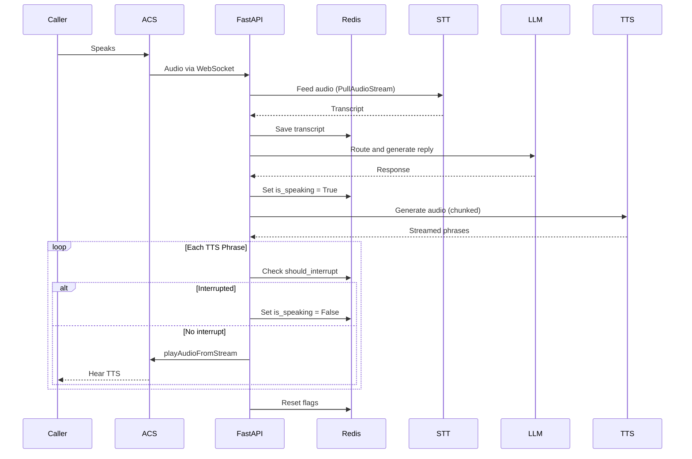
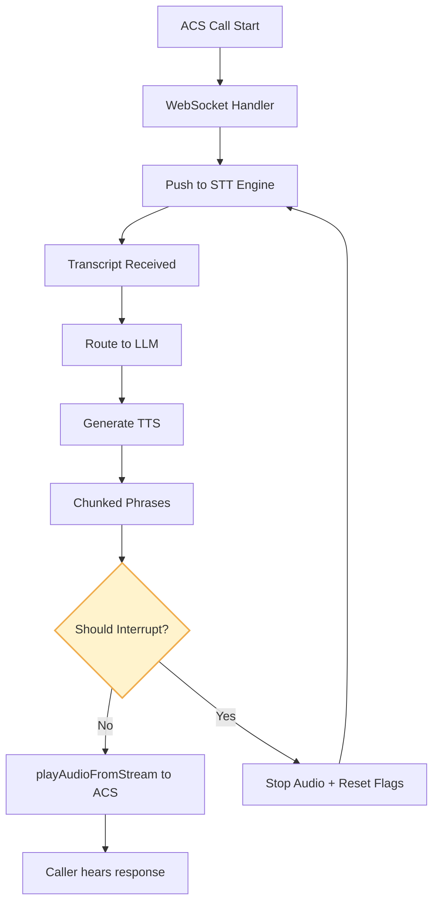
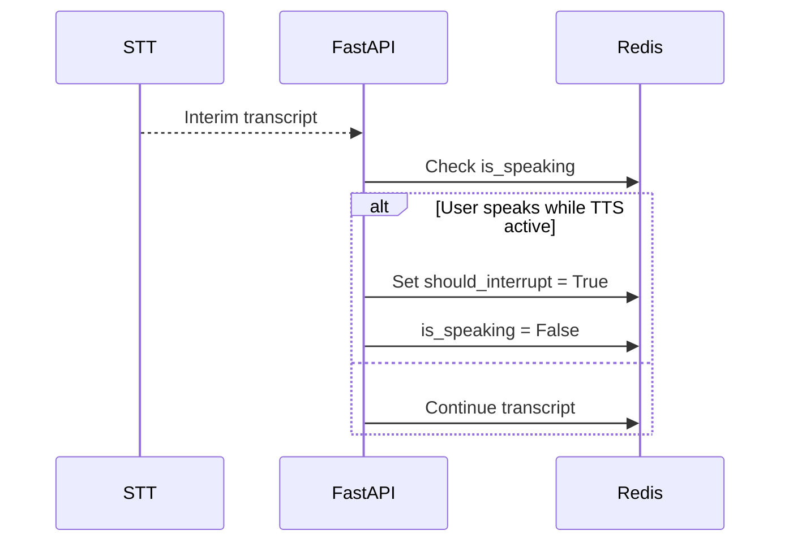

# Voice Activity Detection (VAD) Implementation for Azure Communication Services (ACS)

## Sequence Diagram: Full Voice Interaction with Interruptions

This diagram illustrates the end-to-end flow of a voice interaction, including interruption handling:
- Audio input is streamed from the caller to ACS, then to FastAPI, and processed by STT.
- Transcripts are stored in Redis and routed to the LLM for response generation.
- TTS output is broken into phrases, with each phrase gated by an interruption check in Redis.
- If the `should_interrupt` flag is set, TTS playback stops and state is reset.

## System-Level Flow: Voice App with Redis State Checks

This flowchart outlines the system-level decision process:
- The call progresses linearly through WebSocket handling, STT, LLM, and TTS chunking.
- The "Should Interrupt?" decision node determines whether to continue audio playback or stop/reset based on VAD logic.
- Interruptions loop back to STT input, maintaining conversation continuity.

## Side Flow: STT Detects Interruption During TTS

This sequence details the VAD detection mechanism:
- STT provides interim transcripts during TTS playback.
- FastAPI checks the current speaking state before acting on transcripts.
- Redis flags are used to coordinate state transitions.
- User speech during TTS triggers interruption flags immediately.

#### **Approach Overview**

This section documents the Voice Activity Detection (VAD) approach for Azure Communication Services (ACS) voice interactions, focusing on real-time interruption handling and state management.

1. **Redis-Based State Management**  
    Redis is used to manage conversational state and interruption flags. This enables:
    - Low-latency state checks (sub-millisecond)
    - Scalability across multiple workers
    - Persistence of state across connection interruptions
    - Seamless integration with conversation state logic

2. **Azure STT Integration**  
    The solution leverages Azure Speech-to-Text v2 (STTv2) for continuous recognition, providing:
    - Interim transcription results for real-time VAD
    - Error handling and resilience features
    - Authentication via Managed Identity
    - Performance optimizations for cloud-native workloads

3. **Chunked TTS with Interruption Points**  
    Text-to-Speech (TTS) responses are generated and streamed phrase-by-phrase. Each phrase boundary serves as a potential interruption point, allowing:
    - Responsive, natural conversation flow
    - Fast reaction to user interruptions
    - Reduced audio latency
    - Graceful handling of interruptions

## Implementation Artifacts

### **1. VAD Configuration Class**

Defines configurable parameters for VAD, including sensitivity thresholds, Redis flag names, and audio quality settings.

### **2. VAD State Manager**

Implements state management logic using Redis, including:
- Setting and clearing speaking/interruption flags
- Detecting user speech during AI responses
- Coordinating state transitions for interruption handling

### **3. Enhanced ACS WebSocket Handler Integration**

Describes integration points for VAD within the ACS WebSocket handler, including:
- Initializing VAD components
- Handling interim and final STT results
- Managing TTS playback with interruption checks

### **4. Performance Monitoring**

Outlines metrics and telemetry collection for VAD, such as:
- Number of interruptions detected
- Response times
- User satisfaction scores

### **5. Testing Framework**

Provides a testing suite for VAD logic, covering:
- User interruption detection
- State transitions
- TTS interruption handling

## Looking Into

Potential areas for future improvement include:
- Fine-tuning VAD sensitivity parameters for different languages or environments
- Enhancing false positive/negative detection in interruption logic
- Integrating advanced analytics for user satisfaction and conversation quality
- Supporting additional state backends or distributed cache options

